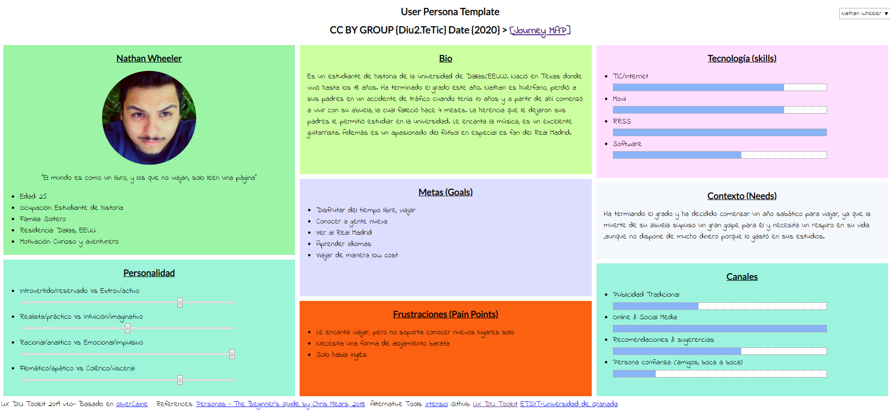
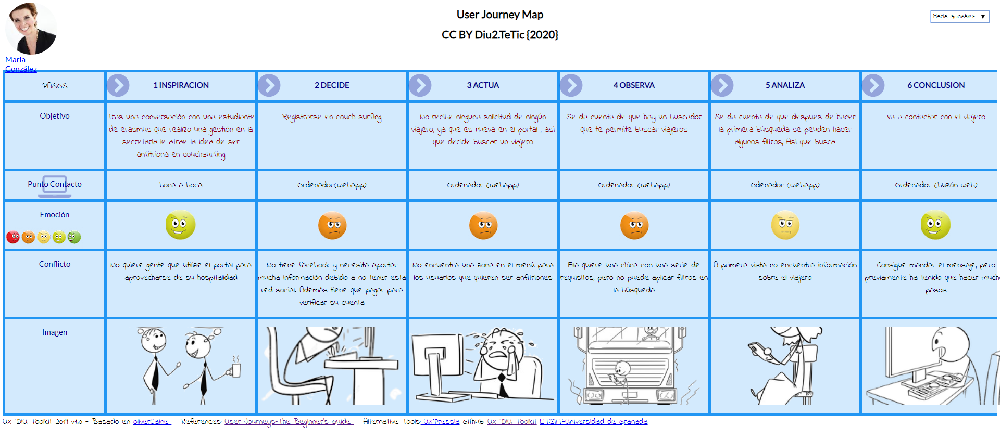
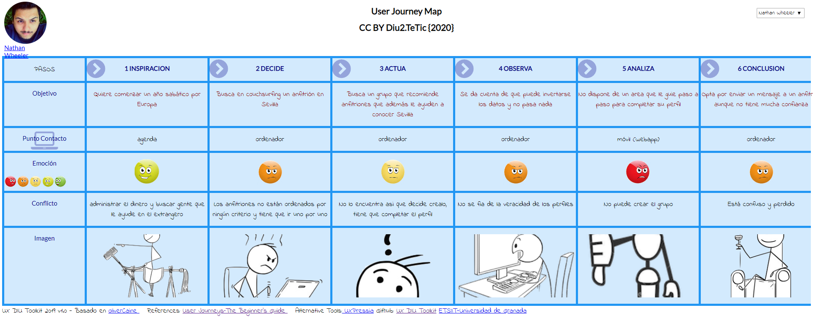
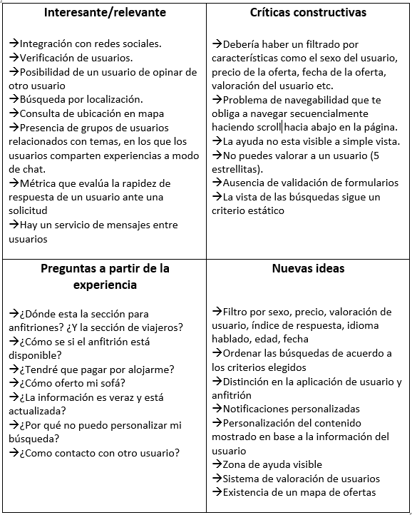

# DIU20
Prácticas Diseño Interfaces de Usuario 2019-20 (Economía Colaborativa) 

Grupo: DIU2.TeTic  Curso: 2019/20 

Proyecto: App de compartir alojamiento (FREE SOFA)

Descripción:En esta práctica estudiaremos un caso de plataforma de economía colaborativa y realizaremos una propuesta para su diseño Web/movil. Utilizaremos herramientas y entregables descritos en el siguiente CheckList (https://github.com/mgea/UX-DIU-Checklist). En particular se pretende diseñar FREE SOFA. Está aplicación será una plataforma de economía colaborativa en lo referente a compartir alojamiento.

Logotipo: 

Miembros
 * :bust_in_silhouette:   Miguel García Tenorio     :octocat:[migueg](https://github.com/migueg/DIU20)     

----- 

Qué es economia colaborativa: Martínez-Polo, J. (2019). **El fenómeno del consumo colaborativo: del intercambio de bienes y servicios a la economía de las plataformas**, *Sphera Publica, 1*(19), 24-46. http://sphera.ucam.edu/index.php/sphera-01/article/view/363/14141434

>> ¿ Cómo puedo viajar sin tener que pagarme un hotel ?

Esta fue a pregunta que llevo al desarrollo del proyecto y me incentivó a aplicar los objetivos de economía colaborativa.

Qué es economia colaborativa: Martínez-Polo, J. (2019). **El fenómeno del consumo colaborativo: del intercambio de bienes y servicios a la economía de las plataformas**, *Sphera Publica, 1*(19), 24-46. http://sphera.ucam.edu/index.php/sphera-01/article/view/363/14141434

# Proceso de Diseño 

## Paso 1. UX Desk Research & Analisis 

 1.a Competitive Analysis
-----
En primer lugar investigué y analize, emperesas que llevan a cabo esta propuesta y ofrecen la posibilidad de alojarse en otros lugares de manera mas barata.

Para el servicio de compartir alojamiento, evalué las web de Badi, de CouchSurfing y de ComparteTuPiso. Todas ellas ofreían una manera alternativa de alojarse de manera mucho mas barato o incluso gratis a cambio de experiencias. Todas ellas tenían en común:

+ Existen mensajes entre usuarios.
+ Existen solicitudes de alojomientos
+ Hay dos roles: viajeros y anfitriones.
+ Existe un buscador de alojamiento por localidad.
+ Están vinculadas a las redes sociales.

Tras obtener los puntos comunes se escogió Couchsurfing para su estudio de usabilidad, ya que ha sido la que proporciona una funcionalidad más completa de las evaluadas y se acerca algo mas a lo que estabamos buscando, una aplicación que permita a los viajeros alojarse de manera gratuita pero que tambien entre en contacto con las personas, es decir, que se parezca a una red social.

 1.b Persona
-----
A continuación creamos dos personas para identificar las metas y los puntos débiles  de nuestro usuario objetivo.Al elegir estas dos perosnas no centraremos en como interaccionarian con Couchsurfing. 

 Mi primera persona elegida es Nathan. Esta persona, es un joven, que ha acabado su carrera y va a comenzar un año sabático. Representa el perfil de un usuario que adopta el rol de viajero o huesped.
 

Persona segunda persona es María. Esta persona , es una funcionaria, que tiene pocos amigos y su rutina se esta volviendo en su condena. Maria encaja perfectamente con el segundo rol, que es el de huesped.

Pude identificar que estas una serie de objetivos comunes:
+ Los usuarios deseaban aprender idiomas y necesitaban encontrar gente que hablase el suyo
+ Estan abiertos a conocer y a socalizar con nuevas personas
+ Los usuarios quieren vivir nuevas experiencias

También identifiqué los puntos débiles:
+ Puede haber problemas de comunicación entre usuarios
+ No todos tienen dinero para gastar.

 1.c User Journey Map
----

A continuación creamos una exeperiencias de usuario para cada una de nuestras personas en couchsourfing ya que representan los dos típicos caso cómunes de experiencias que puede haber. La experiencia de un usuario jovén con un dominio en las tecnologías, pero que también puede ser novato en el método. En segundo lugar se ha elegido la experiencia de una persona de mediana edad con poca soltura con las nuevas tecnologías y que desconoce por completo el método.

 1.d Usability Review
----
Una vez vistas las experiencias que podían tener nuestros usuarios, hice un resumen de usabilidad, en la que evalue CouchSourfing , y obtuve los principales problemas que tenía en el diseño.
 - Valoración final: 63
 - Comentario: Esta valor es dado ya que la interfaz es sencilla y las funcionalidades están a simple vista, pero presenta problemas 
que pueden ensuciar la experiencia en el diseño  como  la falta de información verificada, no existía una diferenciación de los roles de usario o la ausencia de filtros para las búsquedas

## Paso 2. UX Design  
 Tras esta etapa de indagación, comence a buscar cual sería el problema real al que se enfrentaban los usuarios y como podía abordar este problema en el desarrollo de la app.
 
 Como consecuencia se me ocurrió el siguiente problema:
>>Las personas que buscaban un alojamiento de manera gratuita o muy barato necesitaban una manera de conectar con los usuarios de manera >>eficaz y comprobar que ese usuario era de fiar, es decir, el principal problema era la desconfianza de los usuarios.

 2.a Feedback Capture Grid
----
***¿Cómo podía  solicionar esto?

Para enocontrar una solución y poder reflejar en el diseño de FREE SOFA realice un FeedBack Capture Grid de CouchSourfing ya que era la plataforma que mas se ajustaba a lo que estaba buscando. 
El diagrama propuesto refleja los aspectos más destacados de couchsurfing, presentando los problemas, las dudas a partir de las experiencias de María y Nathan, los aspectos positivos que tienen la app y una serie de nuevas ideas aportadas.

De acuerdo con estos datos se planteó como pruepuesta de valor FREE SOFA, un módelo de aplicación para la experiencia de compartir alojamiento. Esta app contará con funcionalidad que puede requerir está experiencia, tal como , la búsqueda por filtros, notificaciones, mensajeria, perfiles de usuario etc. Con mi propuesta quería reflejar un app que combinaba esa experiencia de comparti alojamiento de manera gratuita o  con muy coste con una red social que conectacse a los usarios con posibilidad de interacción entre ellos, para darle un punto de vista , veraz, social y de cercanía con el usuario.

 2.b Tasks & Sitemap 
-----
Una vez que ya tuve claro como iba a ser mi aplicación y que puentos fuertes tendría, comencé a realizar el diseño de esta. En primer lugar realice  el sitemap de la app y la matrix de tareas de usuario que contiene la lista de tareas que puede realizar un usuario ordenadas de mayor a menor de acuerdo con la frecuencia de uso que hacen los usuarios de estas tareas. Tendremos dos grupos de usuarios el de los anfitriones y el de los viajeros.

 2.c Labelling 
----
Ya tenía estructurada mi aplicación por lo que definí que es lo que haría cada uno de los elementos de la jerarquía de la aplicación mediante un labelling

|   |   |
|---|---|
|**Inicio sesion** |Es la primera vista del usuario cuando se descarga la app, en la que podrá registrase o loguearse. Una vez logeado ya no accederá mas a esta vista, no ser que cierre sesión. |
|**Sobre nosotros** | Contiene información sobre los desarrolladores y sobre el sitio como empresa y organización |
|**Contáctanos**| Aqui se podra enviar un formulario con alguna duda o información que vaya dirigidos al personal de la empresa |
| **Home page**                  | Página principal del sitio. Ofrecerá una vista persobnalizada con información que pueda interesar al usuario, de acuerdo con sus preferencias  |
|**Experiencias certificadas**| Se muestran experiencias y vivencias de otros usuarios expertos en el metodo a traves de videos, fotos y comentarios. |
|**Ayuda**| Sección de ayuda técnica al usuario con apartado de FAQS y un foro de duda |
| **FAQS**                       | Aqui se consultan los fallos y duadas más comunes que se tienen entre los usuarios, divididas por categorias, a las cuales se responden mediante texto o con video tutoriales explicativos  |
| **Foro**                       | Este es un foro de dudas técnicas en el que el usuario publicará su duda particular para que pueda ser resuelta por otros usuarios o por trabajadores de la marca   |
| **Grupos**                     | Ofrece la posibilidad a los usuarios de crear grupos, unirse a ellos y buscarlos. La búsqueda se realizará por nombre de grupo y tendrán límite de usuarios. En estos grupos los usuarios podran intercambiar mensajes destinados a comunicar a estos. Habrá grupos oficiales controlados por la app   |
| **Amigos**                     |  Ofrece un listado de los amigos que tienes en la plataforma para poder acceder a ellos facilmente, además existirá un búscador para buscar dentro de esta sección por el nombre. Si el usuario tiene Facebook integrado con la app además de los amigos que tienen en la plataforma le aparecerá aquellos amigos que tiene en Facebook que tienen la app |
| **Búsqueda Avanzada**  | En esta sección se  ofrecen dos opciones , búsqueda de ofertas o búsqueda de perfil , las cuales nos redirigen a un tipo de búsqueda determinada  |
| **Busqueda perfil**  | Se realiza una búsqueda por nombre de usuario mediante un búscador con la posiblidad de aplicar filtros de sexo, edad, valoración , idiomas hablados y tipo de perfil (viajero o anfitrión) . El resultado de esta búsqueda será una lista de perfiles que cumplen los requisitos de la búsqueda. Además se podrá ordenar dicha lista |
| **Perfil**  |  Nos muestra el perfil  de un usuario. Aparte de consultar la información básica,índice de respuesta, se podrá ver las fotos que haya subido, asi como agragarlo a amigos , un boton para enviar mensajes , valorarlo. Si eres viajero podrás consultar el calendario con fechas ofertadas para solicitud, además de consultar información de su casa |
| **Búsqueda Mapa** | Nos ofrece una búsqueda  por localización. A aparte de los filtros de las búsqueda por perfil, se incluirán en el caso de los viajeros un rango de dinero a pagar por la estancia. El resultado se mostrará en un mapa físico de la localización en el que se muestran con marcadores de ubicación las ofertas disponibles. Si eres viajero solo se mostrán ofertas de anfitriones, si eres anfirtrión solo se mostrarán ofertas de viajeros  |
| **Oferta**  | Muestra el perfil del usuario que ha realizado la oferta , la localización de la oferta , la información básica de dicha oferta, el número de solicitudes realizada a la oferta, fecha de la oferta y un botón para enviar la solictud que nos muestra un formulario y un botón para compartir la oferta  |
| **Ofertas**   |  Formulario para publicar una oferta |
| **Mi perfil**  | Información básica del perfil de un usuario , con zona de galeria de fotos, opiniones, valoración general, disponibilidad. En el caso de los anfitriones tendrán una zona de su casa, asi como un calendario con fechas disponibles. Se podrán subir nuevas fotos, y editar la información del perfil. Ofrece dos apartados adicionales verificar perfil e Integrar Facebook . Además se indicará el tipo de usuario (anfitrión o viajero)   |
| **Notificaciones**  | Este es el centro de notificaciones del usuario, en el tendrá dos zonas, una zona general con notificaciones generales y una zona de solicitudes en el que recibe todas las solicitudes echas al usuario    |
|**Mensajes**   |  Buzón de mensajes de la app, apereceran los mensajes recibidos en forma de chat y se podrá enviar un mensaje a otro usuario. Abrá un buscador que permite buscar al remitente solo si en esta en nuestros amigos |
| **Verificar**  | Formulario que pedirá el dni del usuario, una dirección , un telefono móvil  |
| **Integrar facebook**  | Nos llevará al login de facebook y una vez hecho tendremos las funcionalidades de Facebook disponibles  |

 2.d Wireframes
-----
Ya que tenía mi idea de como iba estar estructurada la aplicación y que es lo que haría cada cosa, me centre en el diseño de los bocetos. Esro produjo resultados interesantes como puede ser la **búsqueda de ofertas** mediante un mapa, la posibilidad de **subir ofertas** mediante un formulario, una **sección de amigos** , una **zona de notificaciones** , un **chat de mensajes** . 

Con estos bocetos se acercaba la aplicación más a la idea de una red social que a la idea de una aplicación de ofertas de alojamiento, así que le diseño iba bien encaminido, había conseguido plasmar esa idea en los bocetos.

## Paso 3. TeTic UX-Case Strudy 

 3.a ¿Como se cuenta un UX-Case Study?
-----
Antes de entrar en detalle con los guidelines, analice el UX-Case de MuseApp. En este análisis puede darme cuenta de la importancia que tiene el conocer bien a los usuarios a la hora de realizar un diseño y la importancia de que este se adapte al usuario y que no sea el usuario el que tenga que adaptarse a nuestro diseño. Asi que la fase de indagación es fundamental. 

Tras este aprendizaje me propuese a realizae un logotipo y un guideline centrado en el usuario.

  3.b Logotipo 
----

 3.c Guidelines
----

El guideline que se propone sigue las pautas del guideline para IOS ya que se esta diseñando la app para este sistema. De mi guideline puedo destacar lo siguiente: 
+ Se utilizarán colores complementarios en la aplicación, que combinen con el logo
+ Todo botón de cancelar va siempre a la derecha
+ Se utilizan colores complementarios para diferenciar entre perfiles de viajeros y perfiles de anfitrión.
+ Tipología: SF y NY
+ Iconos sencillos y facilemente asociables.
+ El botón de ir hacia atrás a la izquierda
+ Se usan los iconos de apple para las distintas acciones

  3.d Video
----
[Video](https://youtu.be/YD0msLorQco)

# DIU - Practica 4
Lista de proyectos (en github) https://github.com/mgea/DIU20/blob/master/P4/proyectos.md
## Paso 4. Evaluación 
4.a Casos asigandos
-----
>**Caso1**

El primer caso evaluado es el del equipo DIU1_1SHOT que nos ofrece la propuesta diseño de Share to fly una app basada en la experiencia de compartir viajes que busca otener un modelo de app que convine los viajes con una red social, tomando como punto de partida la app Passporter y ofrciendo una prupuesta de valor a partir de esta, basada en la mejora de las búsquedas y la posibilidad del usuario de poder crear y gestionar itinerarios de viajes que puedan utilizar el resto usuarios. 

Después de la evaluación de este caso se han obtenido los siguientes tres puntos fuertes:

+ Se han utilizado unas buenas personas ficticias: Las personas utilizadas no están creadas especifacamente para el diseño de su propuesta si no que estás personas encajan con un perfil de usuario que puede ser utilizadas para el diseño de muchas otras aplicaciones
+ El análisis competitivo realizado es bastante bueno y ha permitido que el equipo haya descubierto que es lo que hace falta en su diseño y cuales son los errores comunes en este tipo de apps que deben mejorarse.
+ Se ha optado por un patrón de diseño específico y aportan unas guilines muy concretas y adaptadas a su diseño de manera que en un futuro desarrollo el aspecto de la aplicación ya está muy detallado.

Los puntos débiles del diseño son:

+ A partir de los mapas de experiencia no se puede saber cuál es el problema real que tienen los usuarios.
+ La propuesta de valor no se describe bien, solo se menciona en la introducción muy brevemente.
+ La idea que percibes cuando observas el sitemap y el labelling es contraria a la que muestran los bocetos que no se adaptan muy bien a la estructura del sitemap.

Enlace en formato xls : https://github.com/migueg/DIU20/blob/master/P4/ShareToFly-review.xls

Enlace en formato pdf:  https://github.com/migueg/DIU20/blob/master/P4/ShareToFly-review.pdf

>**Caso 2**

El segundo caso evaluado en un principio era el de DIU2.CIAMaria  pero la url no era la correcta, así que se escogió al equipo DIU2.cumbia para ser evaluado. Este equipo nos ofrece la propuesta de King couch una app web que nos ofrece la experiencia de compartir alojamiento, en concreto te permite tanto ofrecer como reservar un sofña para viajar de manera mucho mas económica e intenta ofrecer un tipo de app que tenga un aspecto de red social.

Después de la evaluación de este caso se han obtenido los siguientes tres puntos fuertes:

+ Se han elegido unas buenas personas ficticias, que no están creadas especificamente para el diseño alternativa y que podrían encajar en otros diseños.
+ Los mapas de experiencia son buenos ya que muestran problemas en el diseño y que son considerados en el diseño de King couch.
+ Se ha diseñado un logotipo que resumen perfectamente la propuesta de valor en una imagen.

Los puntos débiles del diseño son:

+ El análisis competitivo esta bastante incompleto y solo se ha tenido en cuenta una alternativa.
+ El informe de usabilidad no nos muestra los problemas de usablidad del sitio escogido para su estudio
+ El labelling, el sitemap y los bocetos no se corresponden. Los bocetos no reflejan muy bien lo dispuesto en el sitemap.

Enlace en formato xls : https://github.com/migueg/DIU20/blob/master/P4/KingCouch-review.xls

Enlace en formato pdf:  https://github.com/migueg/DIU20/blob/master/P4/KingCouch-review.pdf

>**Caso 3**

El tercer caso evaluado es el del equipo DIU3_BNET que nos ofrece la propuesta de diseño de EventWORLD, una app basada en la experiencia de compartir eventos que nos permitirá elegir y/o reservar cualquier tipo de evento, así como recomendar a otros usuarios eventos ya realizados, valorarlos y reservarlos. En un primer lugar la app fue pensada para la web pero se cambió de decisión a una app para movil a medida que se avanzo en el diseño.

Después de la evaluación de este caso se han obtenido los siguientes tres puntos fuertes:

+ Las personas ficticias elegidas son bastante buenas. Podrían servir para el diseño de otras alternativas.
+ Los wireframe son bastante claros y se adaptan muy bien a la propuesta. En todo momento son coherentes con el sitemap y se puede apreciar claramente como se navegaría en la app
+ Ha sido capaz de plasmar todas la ideas recogidas en la etapa de análisis en la etapa de diseño. Hay un equilibrio entre disño y análisis.

Los puntos débiles del diseño son:

+ El análisis competitivo no es muy completo
+ El equipo no ha realizado un logotipo que plasme su propuesta
+ El video no cuenta una historia de diseño clara , sino que se centra en explicar como funcionaria algunas funcionalidades de la app a través del wireframe.

Enlace en formato xls : https://github.com/migueg/DIU20/blob/master/P4/EventWORLD-review.xls

Enlace en formato pdf:  https://github.com/migueg/DIU20/blob/master/P4/EventWORLD-review.pdf

4.a User Testing
-----

La persona elegida para el user Testing es Nathan

>**Caso1**

Nathan como es un apasionado fan del Real Madrid decide hacer un viaje a Madrid desde su pais, pero como es inexperto en realizar viajes necesita que alguién le ayuda a planificarse. Busca en Internet pero no encuentra ninguna referencía que le sea de ayuda para planificarse. Un día viendo historias en Instagram le aparece un anuncio de Share to Fly, una app que encajaría perfectamente en lo que busca. Comienza a usar la app web y busca sin estar registrado un viaje planificado a Madrid. Encuentra uno que le gusta, así que decide apuntarse, pero previamente se tiene que registrar. Una vez registrado se apunta, pero el itinerario planificado contiene sitios que necestan entrada previamente pagada y necesita pagarla desde la página del evento de la cual no está en enlace disponible y en la página web del evento dice que no hay más entradas, así que ese itinerario de viaje ya no le sirve. Por lo que opta por planificarse el viaje el solo.

>**Caso 2**

Nathan en su viaje Madrid necesita buscar alojamiento , pero como ya se a gastar mucho dinero en las entradas del partido del Real Madird y en el vuelo necesita rebajar costes en el alojamiento. Un amigo suyo de la universidad le recomienda el uso de  King Couch para buscar una forma de alojamineto más barata. Asi que se registra en esta app y busca ofertas. Encuentra una que se encuentra en una buena lozalización y a simple vista es atractiva. Pero para su asombro no hay valoraciones ni opiniones de otros usuarios que se hayan alojado con ese anfitrión , asi que esa desconfianza le hace mirar por otras webs.

>**Caso 3**

Natahan ya que visita Madrid quiere empaparse de la cultura española y conocer a gente nueva. Así que decide buscar algún evento en Madrid en el que poder apuntarse y cumplir este objetivo. Investigando un poco por la web encuentra que hay una nueva app para el móvil que tiene buena valoración por parte de los usuarios, así que se la descarga. Se crea un perfil y busca eventos en la ciudad de Madrid. Encuentra uno que le llama la atención, además en el evento hay valoraciones de otros usuarios  y bastante información. Pero encuentra una valoración negativa de un usuario y le gustaría mandarle un mensaje a ese usario para saber que pasa, pero la app no le ofrece esa posbilidad. Como el resto de comentarios son buenos, se decide por ese evento , lo reserva y paga online.

4.c Ranking
-----
Tras evaluar estos tres casos, en mi opinión el ranking en el diseño de una propuesta sería el siguiente: 

1. DIU1_1SHOT
2. DIU3_BNET
3. DIU3_cumbia

En general, las tres propuestas de diseño son acertadas y se adaptarían bien a los usuarios. Todas tienen en común que se intenta dar un enfoque de red social a las propuestas de diseño, ya que hoy en día  las redes sociales son apps con las que casí todos los usuarios de nuevas tecnologías usan y están familiarizados. Además ese enfoque de economía colarobativa propicia que el las apps se parezcan a una red social. Otro punto importante es que en los tres casos evaluados, siempre se usa dos tipos de personas ficticias para elaborar una buena experiencia, aquella persona que es experta en el uso de las nuevas tecnologías porque las usa a diario y se adapta facilmente a cualquier tipo de app y aquella persona de una edad más avanzada que no esta tan familiarizada con el uso de apps y que necesita un diseño sencillo y en muchas ocasiones ayuda para usar la app, ya que su proceso de adaptación es más lento. Estos dos tipos de personas se identifican perfectamente con los usuarios que hay en la actualidad, debido a que las apps son relativamente nuevas.
Por último concluir que en los tres diseños se opta por la sencillez, de manera que el usuario tenga la funcionalidad a simple vista y que esta funcionalidad sea sencilla de utilizar y que tenga los pasos para su utilización y opciones bien claras,definidas e indicadas sin ambiguedades de ningún tipo.

